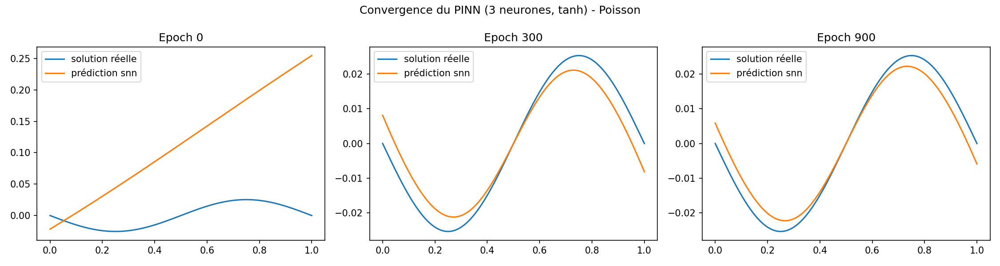
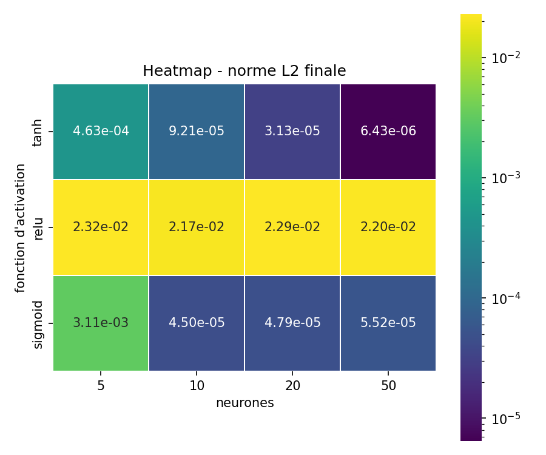
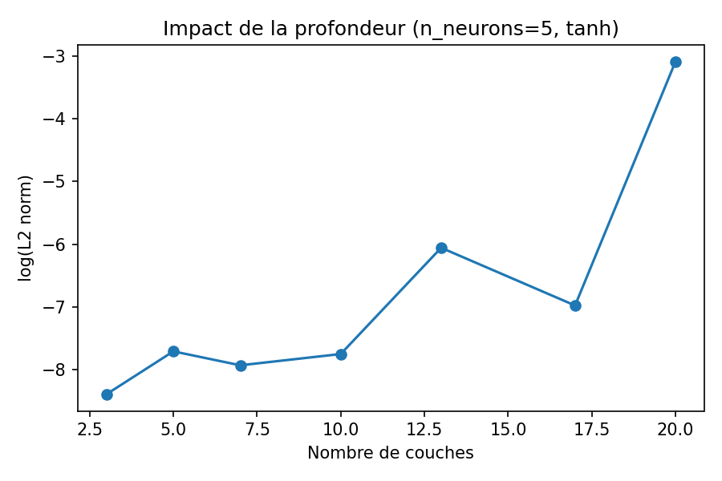
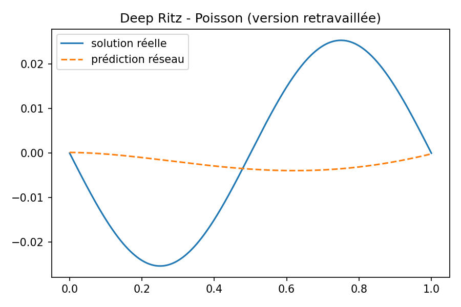
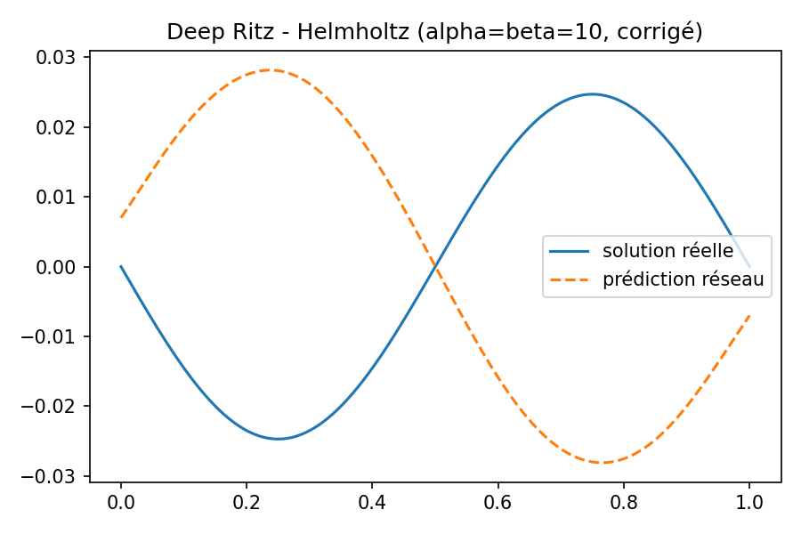
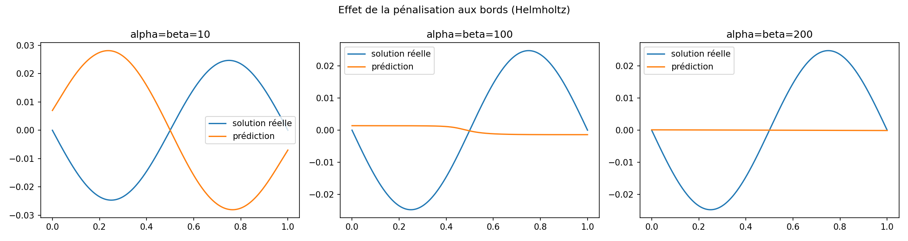

# Résolution d'équations aux dérivées partielles par réseaux de neurones (PINN & Deep Ritz)

Projet de première année — École Nationale des Ponts et Chaussées (2026), réalisé au laboratoire **CERMICS**, sous la direction de Sofiane Ezzehi.

**Auteurs** : Paul Rivaud, Timoté Missaye, Soufiane Ait Abbou, Pierre Kairo

Rapport complet : [`report/rapport_PINN.pdf`](report/rapport_PINN.pdf)

---

## Contexte

Les équations aux dérivées partielles (EDP) sont traditionnellement résolues par des méthodes de discrétisation (différences finies, éléments finis). Ce projet explore une approche récente et *mesh-free* : approximer directement la solution d'une EDP par un réseau de neurones, entraîné à minimiser un résidu physique plutôt que sur des données étiquetées.

Deux problèmes 1D sur l'ouvert (0, 1) sont étudiés :

- **Équation de Poisson** : $-u''(x) = f(x)$, $u(0) = u(1) = 0$
- **Équation de Helmholtz modifiée** : $-u''(x) + u(x) = f(x)$, $u(0) = u(1) = 0$

Deux méthodes de résolution sont comparées :

| Méthode | Principe | Avantage | Inconvénient |
|---|---|---|---|
| **PINN** (Raissi et al., 2019) | Minimise le résidu de la formulation forte de l'EDP | Convergence rapide et précise | Nécessite de calculer $u''$ (activation deux fois dérivable obligatoire) |
| **Deep Ritz** (E & Yu, 2017) | Minimise une fonctionnelle d'énergie (formulation variationnelle/faible) | Une seule dérivation nécessaire | Convergence plus lente |

## Résultats principaux

### PINN — convergence sur l'équation de Poisson (3 neurones, tanh)



### Choix de la fonction d'activation

tanh et sigmoid (deux fois dérivables) convergent correctement ; **ReLU échoue structurellement**, sa dérivée seconde étant nulle presque partout, ce qui rend le résidu de l'EDP non minimisable.



### Impact de la profondeur du réseau

Au-delà d'une quinzaine de couches, la performance se dégrade brutalement (vanishing gradient avec tanh) : un réseau peu profond suffit largement pour ce problème 1D.



### Deep Ritz — Poisson et Helmholtz




### Effet de la pénalisation des conditions aux limites (Helmholtz)

Une pénalisation trop faible viole les conditions aux limites (*underfitting* des bords) ; une pénalisation trop forte fait négliger l'équation sur l'intérieur du domaine.



Le détail théorique (formulations variationnelles, démonstrations, théorème de Lax-Milgram) est disponible dans le [rapport complet](report/rapport_PINN.pdf).

## Structure du dépôt

```
Projet-PINN/
├── README.md
├── requirements.txt
├── LICENSE
├── report/
│   └── rapport_PINN.pdf
├── src/
│   ├── problems.py         # définition des EDP (Poisson, Helmholtz) et solutions exactes
│   ├── models.py            # architectures SNN (1 couche) et DeepNN (multi-couches)
│   ├── operators.py         # dérivées 1ère/2nde par différentiation automatique
│   ├── train_pinn.py        # entraînement PINN
│   ├── train_deepritz.py    # entraînement Deep Ritz
│   └── viz.py                # visualisations (courbes, heatmap)
├── notebooks/
│   └── demo.ipynb           # notebook de démonstration, reproduit les résultats ci-dessus
└── results/                  # figures générées
```

## Installation et exécution

```bash
git clone https://github.com/timosaye-sudo/Projet-PINN.git
cd Projet-PINN
pip install -r requirements.txt
jupyter notebook notebooks/demo.ipynb
```

## Notes sur les écarts entre ce dépôt et le rapport PDF

Le code a été nettoyé et modularisé après la remise du rapport ; deux points méritent d'être signalés en toute transparence :

- **Correction d'un bug** : la fonctionnelle Deep Ritz pour l'équation de Helmholtz contenait une erreur de signe sur le terme $f \cdot u$ (additionné au lieu d'être soustrait). Le signe a été corrigé dans `src/train_deepritz.py` pour être conforme à la formulation du rapport (section 3.2.3).
- **Deep Ritz (Poisson)** : le rapport annonce un entraînement sur 3000 epochs avec $\alpha = \beta = 10$. La version présente dans ce dépôt a été retravaillée après la remise (10000+ epochs, pénalisation renforcée) pour améliorer la précision de convergence ; les valeurs numériques diffèrent donc légèrement de celles du PDF, mais la méthode et la fonctionnelle minimisée restent identiques.

## Références

1. G. Cybenko, *Approximation by superpositions of a sigmoidal function*, Mathematics of Control, Signals, and Systems, 1989.
2. W. E and B. Yu, *The Deep Ritz method: A deep learning-based numerical algorithm for solving variational problems*, Communications in Mathematics and Statistics, 2018.
3. M. Raissi, P. Perdikaris, G.E. Karniadakis, *Physics-informed neural networks*, Journal of Computational Physics, 2019.

## Licence

Ce projet est sous licence MIT — voir [LICENSE](LICENSE).
